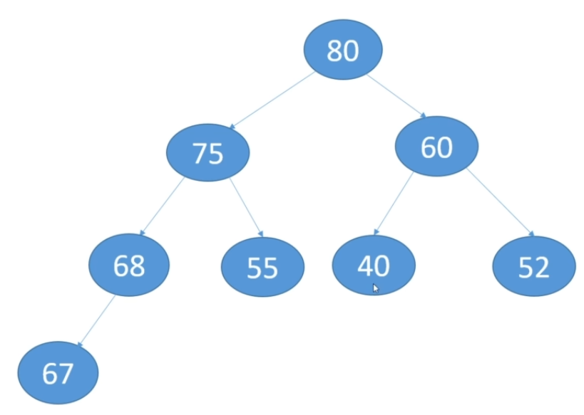

# 26-Heaps
Heap,  Insert. Delete. Peek. Priority Queue. Heap sort algorithm  

Heaps  
-  Must be a complete binary tree
-  Must satisfy the heap property:
    -  Max heap: every parent is greater than or equal to its children  
    -  Min heap: every parent is less than or equal to its children  
-  Children are added to each level from left to right  
-  Usually implemented as arrays  
-  The maximum or minimum value will always be at the root of the tree - the advantage of using heap  
-  Heapify: process of converting a binary tree into a heap. This often has to be done after an insertion or deletion  
-  No required  ordering  between siblings  

A binary tree is complete if every level except the last level has two children and on the last level, the nodes are as left as possible.  

For Binary Search Trees, my implementation use classes  a Tree class and a TreeNode class.  
For Heaps, my implementation use an array.  
  
The Heaps Exists,  mostly because the max or min value is at the root so can be access in O(1) time complexity.  

For a Max Heap if you travel from the root to the leaf all the value are in descending order. Similar to Min Heaps , ascending order.   
This is a way to check a Heap.  

Heaps as Arrays  
-  Put the root at array[0]  
-  Then traverse each level from left to right and add items
-  For the node at array[i]  
    -  left child = 2i + 1  
    -  right child = 2i + 2  
    - parent = floor((i - 1) / 2)  
If we get an index out of bounds, there are no children.  

Insert into heap  
-  Compare the new item against its parent  
-  If the item is greater we swap it (for max heap)
-  Rinse and repeat  
-  Time complexity O(log2n)

Delete from Heap  
-  Must choose a replacement value  
-  Will take the rightmost value, so that the tree remains complete  
-  Must heapify the heap  
-  When replacement value is greater than the parent, fix heap above. Otherwise, fix heap below.   
-  Time complexity O(nlog2n). Find O(n) * fix the heap O(log2n)  

When we use heaps we usually want to work with the root. Min or Max always are at the root.  

The heap for this application:   
&emsp; &emsp; &emsp;&emsp; &emsp; &emsp; 

Associated array: &emsp; &emsp; &emsp; 80, 75, 60, 68, 55, 40, 52, 67

In this app, we initialize an array of 10 element for the heap, the last two elements will be by defaul 0, 0 , but they will not be consider in heap logic.

**Priority Queue**    
 
 The elements of the priority queue are ordered according to their natural ordering.  
 When we add an item we assign a priority for it. Instead of access in the queue specific FIFO, ways we want to access  the highest priority item.  
 Like hospital emergency room.  
 Heaps, backed up by arrays,  are an ideal structure for this because the root has the max or min item.   
 JDK has the PriorityQueue<E> class based on heaps  
    
    
**Heap sort algorithm**

Sort the backe up array of a heap.  
After the sort the array is no longer a heap.
-  The root has the largest value
-  Swap root with last element in the array  
-  Heapify the tree, but exclude the last node  
-  Now second largest element is at the root
-  Rinse and repeat  
    
In-place algorithm.  
Time complexity O(nlog2n). At each iteration of the loop O(n), we have to fix the heap O(log2n).  
    
Alongside with Binary Search Trees, Heap sort algorithm it an good alternativ way to sort an array.

[BACK TO START PAGE](https://github.com/FlorescuAndrei/Start.git) 

    

